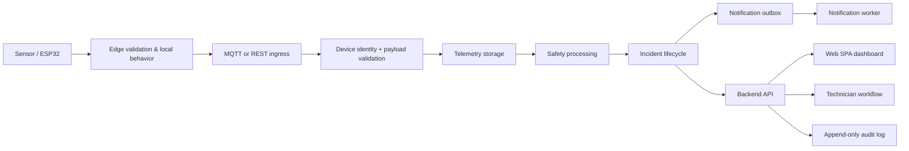

# Backend component architecture

Status: **PROPOSED architecture; no backend is implemented**.

## Trust boundaries

1. **Sensor/edge:** device reading, local validation, local alarm, watchdog and network-loss behavior.
2. **MQTT/REST ingress:** authenticated transport and untrusted payload boundary.
3. **Backend API:** authenticated human-client boundary and server-side authorization.
4. **Database:** central source of truth and transactional boundary.
5. **Notification service:** delivery boundary; a delivery attempt is not a safety conclusion.
6. **Web SPA:** presentation and user interaction only.
7. **Developer/operations tools:** privileged, environment-scoped access with audit.

## Components

| Component | Responsibility | Must not do |
| --- | --- | --- |
| Web SPA | Display scoped data and send authenticated requests | Be the sole safety controller or directly control a valve |
| Backend API | Session, RBAC, site scoping, query/write contracts | Trust client role/site claims |
| Authentication service | Identity/session/token lifecycle | Grant cross-site access implicitly |
| Authorization/RBAC | Permission and assignment evaluation | Read roles from localStorage |
| Device ingestion | Device identity, payload/replay validation, ingress rate limits | Accept device/site routing from payload alone |
| MQTT broker boundary | Topic ACL and broker-to-ingress delivery | Expose all telemetry to browser clients |
| REST ingestion | Device-authenticated REST alternative | Bypass the same validation pipeline |
| Telemetry processor | Persist reading, derive features, invoke approved safety logic | Depend on browser availability |
| Incident service | Transaction-safe open/update/resolve lifecycle | Let `unknown` resolve gas risk |
| Service workflow | Request, maintenance, verification and report revision rules | Alter detection lifecycle |
| Notification dispatcher | Consume outbox, retry and record delivery | Roll back an incident on delivery failure |
| Audit service | Append-only actor/action trail | Store secrets or raw tokens |
| Background worker | Outbox, stale detection, scheduled operational processing | Become an edge fail-safe controller |
| Edge controller | Local safety behavior, local alarm, watchdog | Depend on Internet/backend to take local safety action |

## Proposed data flow

## Edge fail-safe boundary

The browser is not a safety controller. If the browser is closed, event processing and notifications must continue in future backend/worker components. If Internet or backend is unavailable, edge local alarm, device health, watchdog, and validated local safe-recovery behavior remain the edge controller's responsibility. Backend-controlled physical actuation is future work and must not be assumed.

Hardware testing must be performed only under qualified supervision, controlled conditions, manufacturer guidance, and an approved safety plan. This architecture does not prescribe LPG testing.
