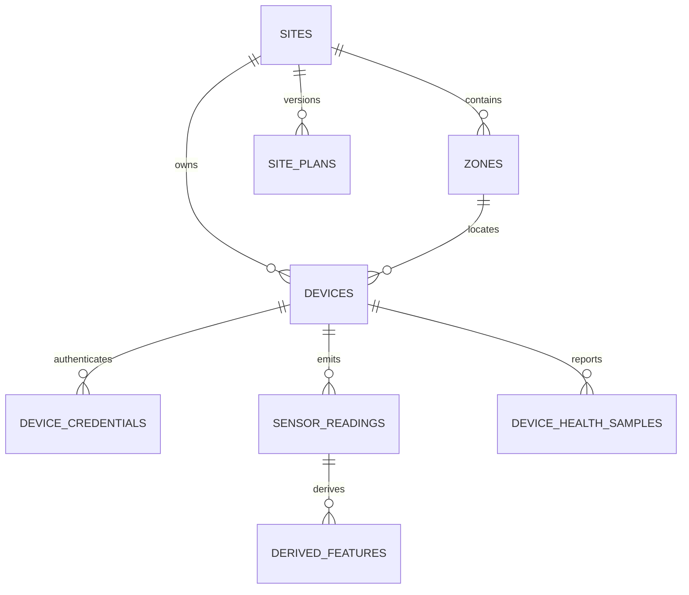
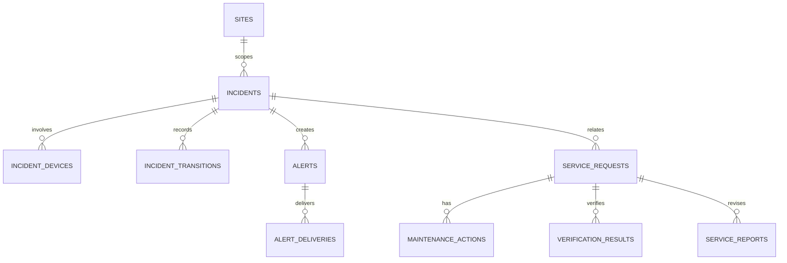
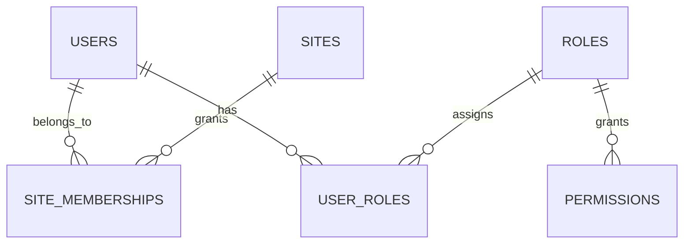

# Conceptual database schema

Status: **PROPOSED**. Types are conceptual PostgreSQL-oriented types; no database exists in this sprint. Timestamps use `timestamptz` in UTC. Numeric telemetry should use `numeric(p,s)` where precision matters; binary floating point needs explicit justification before use.

## Conventions

- Site-owned rows carry non-null `site_id`; global identity/catalog rows explain why they do not.
- `created_at` and `updated_at` are server-generated timestamps unless a record is append-only.
- Credentials are stored only as protected hashes/encrypted references; never plaintext.
- Every user-facing query has a server-side site-scope predicate derived from membership, not a client-supplied site alone.
- `incident_transitions`, `audit_logs`, and finalized report revisions are append-only.

## Entity catalogue

| Area | Entity | Key / site scope | Important conceptual fields | Mutability / indexes |
| --- | --- | --- | --- | --- |
| Identity | `users` | `user_id`; no `site_id` (global identity) | identity provider subject, profile metadata, state | mutable controlled profile; unique provider subject |
| Identity | `roles`, `permissions` | global catalog | role/permission code, description | controlled catalog; unique code |
| Identity | `user_roles` | user-role link; optional environment scope | user_id, role_id | unique user/role/scope |
| Identity | `site_memberships` | `site_id`, user_id | membership state, assignment context | unique site/user; indexed by user and site |
| Location | `sites` | `site_id` | name, facility type, status, owner reference | mutable/audited; unique tenant-scoped name if a tenant model is later approved |
| Location | `zones` | `site_id`, zone_id | name, zone type, plan reference | unique site/name; index site_id |
| Location | `site_plans` | `site_id` | revision, plan data/reference, source | revisions append-only after publish; unique site/revision |
| Devices | `devices` | `site_id`, device_id | hardware identifier, zone_id, state, registration status | assignment changes audited; unique hardware identifier |
| Devices | `device_credentials` | device_id; inherits site through device | credential reference/hash, issued/revoked timestamps | secret excluded from logs; active credential lookup index |
| Devices | `device_assignments` | `site_id`, device_id, zone_id | effective period, assignment reason | temporal history; active assignment unique per device |
| Devices | `firmware_versions` | global catalog | version label, artifact digest/reference | immutable release metadata; unique digest |
| Devices | `device_status` | `site_id`, device_id | observed connection, power, firmware reference, received timestamp | append samples or latest projection; index device/time |
| Telemetry | `sensor_readings` | `site_id`, device_id, zone_id | received_at, device timestamp, sequence, message id, canonical reading payload/columns | immutable; unique device/message-id and device/sequence where applicable; index site/time and device/time |
| Telemetry | `derived_features` | `site_id`, reading_id | feature payload, calculation/rule version | immutable per reading/version; unique reading/version |
| Telemetry | `device_health_samples` | `site_id`, device_id | health metrics, observed_at, source | append-only; index device/time |
| Safety | `incidents` | `site_id`, incident_id | type, lifecycle, opened/updated/resolved timestamps, configuration version | controlled projection; unique active dedupe key is proposed |
| Safety | `incident_devices` | site inherited through incident | incident_id, device_id, role/context | append-only relation; unique incident/device |
| Safety | `incident_transitions` | site_id, incident_id | transition type, at, actor/source, evidence reference | append-only; index incident/time |
| Safety | `alerts` | `site_id`, incident_id | severity, state, created_at | controlled lifecycle; index active alerts/site |
| Safety | `alert_deliveries` | `site_id`, alert_id | channel, attempted_at, delivery state, safe provider metadata | append-only attempts; dedupe index |
| Safety | `actuator_commands` | `site_id`, device_id | requested command, approval context, status | future work; append-only and tightly authorized |
| Safety | `actuator_feedback` | `site_id`, device_id | received feedback, command reference, observed_at | append-only; index command/device/time |
| Service | `service_requests` | `site_id`, request_id | incident_id nullable, zone/device references, status, requester reference | state changes audited; index site/status/time |
| Service | `maintenance_actions` | `site_id`, request_id | action type, observed result, performer role/reference | append-only action records; index request/time |
| Service | `verification_results` | `site_id`, request_id | result, evidence reference, performed_at | append-only; index request/time |
| Service | `service_reports` | `site_id`, request_id | report revision, finalized_at, verification reference | finalized revision immutable; unique request/revision |
| Configuration | `safety_configurations` | site_id nullable only for approved global templates | configuration content, status | changes audited; no threshold changes proposed here |
| Configuration | `configuration_versions` | configuration_id | version, effective timestamp, digest | append-only; unique configuration/version |
| Configuration | `site_configuration_assignments` | site_id | configuration version, effective period | historical assignment; index active site assignment |
| Governance | `audit_logs` | `site_id` nullable only for global action | actor, action, resource, result, correlation, safe metadata | append-only; index site/time and resource |
| Governance | `notification_preferences` | site_id, user_id | channel/category preference | mutable/audited; unique site/user/category |
| Governance | `notification_outbox` | site_id, aggregate reference | event payload reference, idempotency key, dispatch state | transactional outbox; unique idempotency key |

`mock` is a prototype-only marker. Production records should use an explicit `source` / `environment` classification when justified, rather than preserving a mock flag as a trust signal.

## ER diagrams

### Site, device and telemetry

### Incident and service workflow

### Identity and authorization

