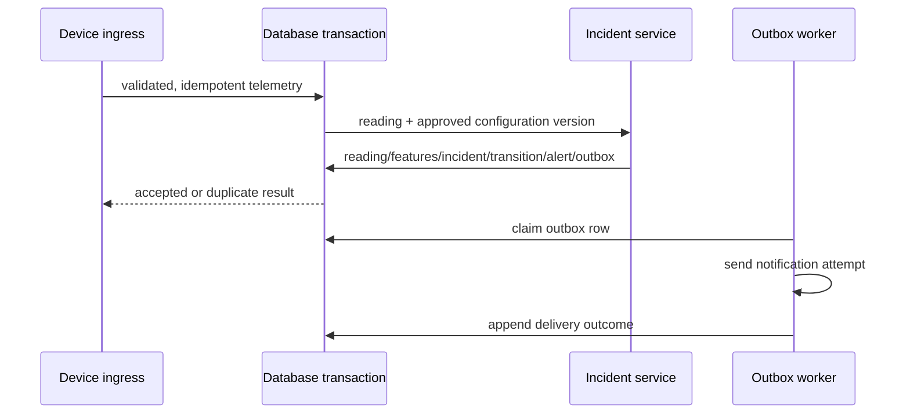

# Incident processing, audit and notification transaction

Status: **PROPOSED**. Existing prototype risk/anomaly formulas and thresholds are intentionally not specified or changed here.

## Transactional processing flow

1. Receive MQTT/REST telemetry with a transport correlation ID.
2. Validate schema and resolve authenticated device identity/site assignment.
3. Evaluate message-id idempotency, replay, ordering and stale policy.
4. Insert immutable sensor reading with server receipt time.
5. Insert derived-feature record tied to reading and approved rule/configuration version.
6. Invoke the approved safety-decision integration.
7. Open, update, or resolve the appropriate Incident projection and append an `incident_transitions` record.
8. Create/update Alert records as needed.
9. Insert notification-outbox rows in the same database transaction.
10. Commit. A worker sends notification attempts after commit and records delivery outcomes separately.

## Invariants

- Deduplication is transaction-safe: a unique idempotency key and row-level/concurrency strategy prevent duplicate active incidents and duplicate notifications.
- `gas_risk` and `system_fault` are separate incident classes.
- `unknown` or stale monitoring must not close an open gas-risk incident.
- Notification delivery failure never rolls back or resolves an Incident.
- Every decision ties to a safety configuration/rule version. This document proposes no new threshold.
- Service workflow finalization does not change detection lifecycle.

## Race conditions to design/test before implementation

- Same device message arrives through MQTT and REST simultaneously.
- Parallel readings attempt to open the same active incident.
- A late/out-of-order safe reading arrives after a newer risk reading.
- A technician action races with an incident update.
- Outbox worker retries while a provider timeout leaves delivery outcome uncertain.
- Device credential is revoked while a message is in flight.

## Audit design

`audit_logs` are append-only. Each record has `audit_id`, UTC timestamp, actor type/id, site ID where applicable, action, resource type/id, result, reason, correlation/request ID, and allowlisted safe metadata. Previous/next version reference or a digest may be used after integrity requirements are decided.

Audit events include login success/failure; role/membership change; device registration/revocation; configuration change; service transitions; maintenance/verification actions; report finalization; device command request; and privileged administrative access. Application logs, security logs, telemetry, incident evidence, and audit records are distinct stores/streams. Passwords, raw tokens, device secrets, credentials, and unnecessarily sensitive payloads are excluded.

## Notification architecture

The transactional outbox is recommended. Alert severity routing, channel preference, in-app notifications, future push, acknowledgement, retry, duplicate prevention, escalation, and delivery status are modeled separately from incident state. UI must show delivery state, not claim successful delivery without confirmation. Emergency behavior is **TBD** pending an approved site emergency plan; this document invents no contact numbers or procedures.
